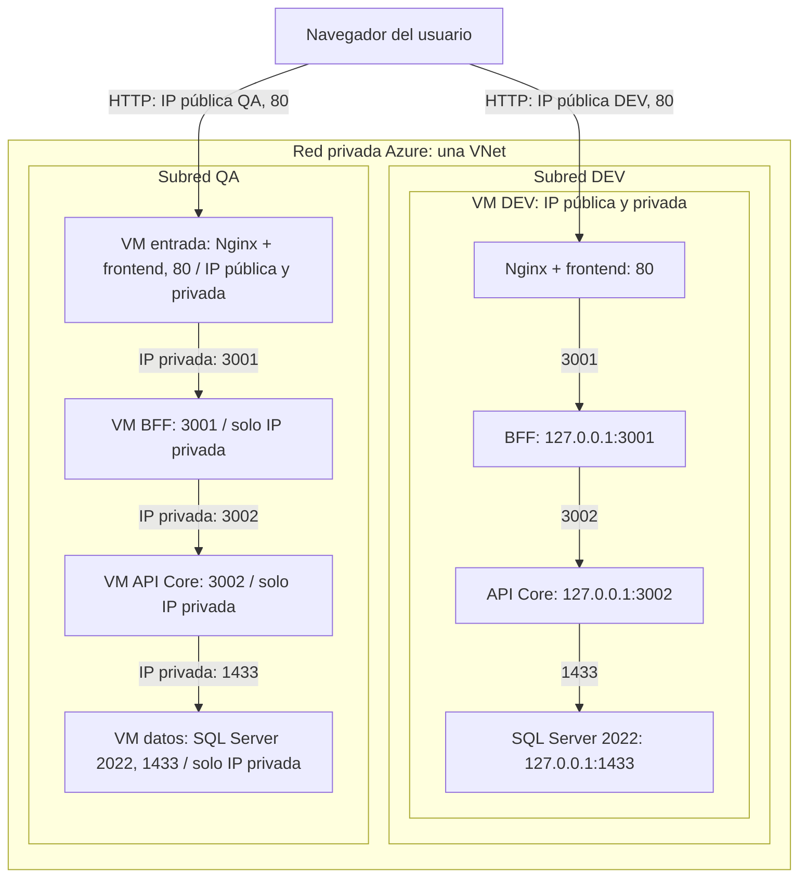
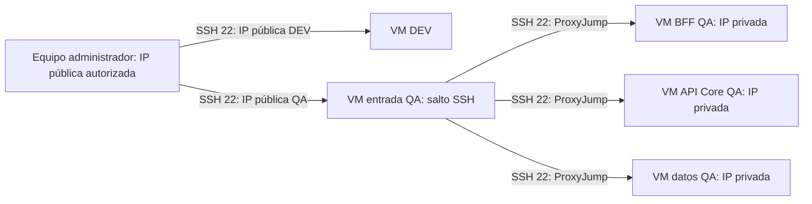

# Topología de despliegue

**Estado: diseño objetivo.** Este documento representa el [plan aprobado](../specs/001-topologia-despliegue/plan.md).
La correspondencia con el despliegue real se verificará en T17; CA8 permanece pendiente.
Los nombres del diagrama son roles, no nombres de recursos ni direcciones asignadas.

## Distribución y tráfico de aplicación

Cinco VMs Ubuntu Server 22.04 LTS: una para DEV y cuatro para QA.
Nginx sirve los archivos del frontend y reenvía sus consultas al BFF.
Las flechas indican conexiones iniciadas; las respuestas regresan por la misma conexión.
Los números indican puertos TCP de destino.

DEV y QA están bloqueados entre sí en ambos sentidos, también cuando se intenta usar sus
IP públicas. Separar subredes no produce ese bloqueo automáticamente: se aplican reglas
explícitas en NSG y firewall del sistema.

En DEV, loopback impide el acceso externo a los servicios internos, pero no bloquea conexiones
entre procesos locales. Las capas se respetan en código y configuración; solo API Core recibe
credenciales de SQL Server. En QA, además, se bloquean los saltos entre capas mediante la red.

## Acceso administrativo

SSH utiliza TCP 22. El equipo administrador accede a DEV directamente y a las VMs privadas
QA mediante ProxyJump por la entrada QA. Las claves privadas permanecen en el equipo administrador.
Este tráfico tiene permisos propios y no habilita saltos entre capas en los puertos de aplicación.

## Permisos de entrada

| Destino | Origen permitido | Puerto TCP |
|---------|------------------|------------|
| Nginx DEV y QA | Usuarios externos | 80 |
| SSH DEV y entrada QA | IP pública administrativa autorizada | 22 |
| BFF QA | IP privada de entrada QA | 3001 |
| API Core QA | IP privada de BFF QA | 3002 |
| SQL Server QA | IP privada de API Core QA | 1433 |
| SSH BFF, API Core y datos QA | IP privada de entrada QA | 22 |

Las restantes conexiones entrantes se rechazan. También se restringen las salidas entre
servidores según el plan, con excepciones operativas validadas al configurar la infraestructura.
Cada VM tiene un NSG asociado a su interfaz de red, complementado por el firewall del sistema.

Ejemplos de conexiones de aplicación bloqueadas en QA: entrada → API Core:3002,
entrada → SQL Server:1433 y BFF → SQL Server:1433. El permiso SSH de la entrada a esas VMs
se limita a administración y no permite esos accesos de aplicación.

## Decisiones relacionadas

- [ADR 0004](adr/0004-reparto-de-entornos-dev-qa.md): reparto de las cinco VMs.
- [ADR 0005](adr/0005-alcance-aislamiento-dev-qa.md): alcance del aislamiento local en DEV.
- [ADR 0006](adr/0006-acceso-administrativo-proxyjump.md): acceso administrativo.
- [ADR 0007](adr/0007-sistema-operativo-y-version-sql-server.md): sistema operativo y motor.
- [ADR 0008](adr/0008-red-privada-y-aislamiento-de-entornos.md): subredes y reglas de red.

Los rangos CIDR, IP reales, tamaños y nombres de recursos se validarán antes del aprovisionamiento.
