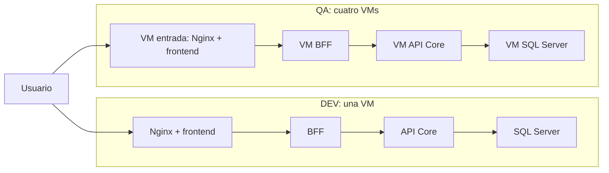

# Plan 001 — Topología de despliegue

- **Spec:** [001](spec.md)
- **Estado:** Aprobado
- **Fecha de aprobación:** 2026-10-02

## Enfoque

Mantener DEV consolidado en una VM y QA distribuido en cuatro VMs Linux, conforme a los
[ADR 0003](../../docs/adr/0003-despliegue-en-vms-separadas-en-azure.md) y
[0004](../../docs/adr/0004-reparto-de-entornos-dev-qa.md). Nginx sirve el frontend y reenvía
las solicitudes del navegador al BFF; las siguientes capas se comunican por red privada.

Este documento define el diseño objetivo. No autoriza aprovisionamiento, instalaciones ni
cambios de infraestructura. Los cambios a las decisiones aceptadas requieren validación antes de implementarse.
La configuración y las pruebas se concretarán en tareas cuando existan los servicios.

## Diseño

### Servidores y punto de entrada

Los roles siguientes son etiquetas del diagrama, no nombres de recursos ya asignados.

| Entorno | Rol de VM | Componentes | Exposición |
|---------|-----------|-------------|------------|
| DEV | Servidor consolidado | Nginx, frontend estático, BFF, API Core, SQL Server | IP pública: HTTP y SSH restringido |
| QA | Entrada | Nginx y frontend estático | IP pública: HTTP y SSH restringido |
| QA | BFF | BFF | Solo IP privada |
| QA | API Core | API Core | Solo IP privada |
| QA | Datos | SQL Server | Solo IP privada |

Nginx es un reverse proxy: recibe una solicitud y la reenvía al servicio interno correspondiente.
El navegador usa el mismo origen para cargar el frontend y consultar al BFF a través de Nginx;
no recibe direcciones privadas del API Core ni de SQL Server.

Las flechas representan solicitudes de aplicación. DEV y QA no tienen flujos entre sí.
El diagrama definitivo en `docs/` incluirá también subredes, puertos y acceso administrativo,
y se actualizará contra el despliegue real para cumplir CA8.

### Red y reglas por servidor

Decisión aceptada: una VNet con dos subredes, una para DEV y otra para QA (ADR 0003 y 0008).
Una subred agrupa direcciones dentro de la red privada; por sí sola no bloquea conexiones.
Asignar un NSG a la interfaz de red de cada VM y complementar con el firewall del sistema.
Un NSG filtra conexiones por origen, destino, protocolo y puerto.

No se fijan todavía rangos CIDR, IP reales, región, tamaños de VM ni nombres de recursos.
Se validarán antes del aprovisionamiento. Las referencias siguientes se sustituirán por las
IP privadas efectivas; no se permitirá toda la subred cuando basta un servidor.

**Puertos aceptados:** HTTP TCP 80, SSH TCP 22, BFF TCP 3001, API Core TCP 3002
y SQL Server TCP 1433. HTTP y SSH usan sus puertos convencionales; 1433 corresponde al
puerto habitual de una instancia predeterminada de SQL Server. Express no impone un puerto:
3001 y 3002 son valores elegidos para las aplicaciones del proyecto, no valores predeterminados.
Se mantienen en DEV y QA, se configuran mediante variables de entorno y se comprueba que estén
libres antes de arrancar los servicios. Las reglas de firewall deben coincidir con esos valores.

| Destino | Origen permitido | Puerto de destino | Uso |
|---------|------------------|-------------------|-----|
| Nginx DEV o QA | Usuarios externos | 80 | Entrada HTTP |
| SSH DEV o entrada QA | IP pública administrativa autorizada | 22 | Administración |
| BFF QA | IP privada de entrada QA | 3001 | Nginx → BFF |
| API Core QA | IP privada del BFF QA | 3002 | BFF → API Core |
| SQL Server QA | IP privada del API Core QA | 1433 | API Core → datos |
| SSH de BFF, API Core y datos QA | IP privada de entrada QA | 22 | Salto administrativo aceptado |

Rechazar el resto de conexiones entrantes, incluidos otros puertos y flujos DEV ↔ QA.
Las reglas específicas de permiso precederán a las de rechazo. Azure permite tráfico dentro
de la VNet por defecto: se necesitan reglas explícitas de rechazo con precedencia sobre esas
reglas predeterminadas. Los NSG mantienen el estado de las conexiones; las respuestas a una
conexión permitida no requieren abrir una nueva conexión en sentido contrario.
Ver [documentación de NSG](https://learn.microsoft.com/en-us/azure/virtual-network/network-security-groups-overview).

Aplicar también restricciones de salida entre servidores para bloquear conexiones nuevas que
salten capas o crucen entornos, incluso hacia las IP públicas de DEV y QA. Antes de aplicar el
rechazo general de salida, identificar las excepciones operativas necesarias para DNS,
actualizaciones y funcionamiento de las VMs. No equivalen a acceso entre capas y no se abrirán
rangos amplios sin justificación. Probar reglas con conexiones nuevas, no sesiones ya abiertas.

En QA, los servicios internos escucharán en la IP privada de su VM. En DEV escucharán en
`127.0.0.1`, la interfaz local de la máquina. No se publicarán sus puertos en interfaces externas.
Si posteriormente se utilizan contenedores, habrá que verificar nuevamente qué puertos publican
y por qué redes se conectan; este plan no define esa configuración.

**Alcance validado de R4:** loopback protege DEV del acceso externo, pero no impide conexiones
entre procesos locales no adyacentes. En DEV, el código y la configuración respetan las capas;
solo API Core recibe credenciales de SQL Server. No se añade aislamiento de red entre procesos
locales. En QA se rechazan mediante firewall los flujos de aplicación que salten capas.
Ver [ADR 0005](../../docs/adr/0005-alcance-aislamiento-dev-qa.md).

### Administración

Decisión aceptada para P1: acceder a DEV por SSH desde la IP autorizada; acceder a las VMs privadas de
QA con `ProxyJump`, usando la VM de entrada QA como salto. Así se conservan cinco servidores
y solo la entrada QA tiene IP pública. `ProxyJump` establece el acceso al destino a través de
una primera conexión SSH; las claves privadas permanecen en el equipo administrador.
Ver [manual de OpenSSH](https://man.openbsd.org/ssh).

La IP autorizada se obtiene y valida al configurar el acceso; no se incluye una IP inventada.
Los permisos del salto se limitarán a SSH hacia las tres VMs internas. Es una excepción
administrativa explícita a la matriz de tráfico de aplicación, no un permiso para Nginx → API Core.
Este acceso administrativo se rige por R5; R4 restringe los flujos de aplicación. Ver [ADR 0006](../../docs/adr/0006-acceso-administrativo-proxyjump.md).

### Configuración y arranque

Las direcciones y puertos se proporcionarán como configuración externa: Nginx conoce al BFF,
el BFF conoce al API Core y solo el API Core recibe la configuración de SQL Server.
En DEV se usan destinos locales; en QA, destinos privados. Al implementar, cada variable real
se documentará en `.env.example`, sin credenciales. La configuración de Nginx deberá generarse
a partir del entorno o un mecanismo equivalente validado; no se asume que expanda variables automáticamente.

R8 requiere un mecanismo de arranque habilitado al iniciar cada VM y datos/configuración en
almacenamiento persistente. La elección entre servicios del sistema y contenedores queda para
el diseño de ejecución correspondiente. El plan no prescribe PM2 ni instala herramientas.
La validación de CA7 debe comprobar el flujo completo después de reiniciar, contemplando que
la base de datos o una capa posterior puede tardar en estar disponible.

## Decisiones

- **Aceptadas:** separación de capas, SQL Server y fuentes mock, VMs Linux en Azure con
  equivalencia on-premise, DEV consolidado y QA distribuido. Ver ADR
  [0001](../../docs/adr/0001-arquitectura-en-capas-con-bff.md),
  [0002](../../docs/adr/0002-sql-server-y-repositorios-mock.md), 0003 y 0004.
- **Aceptada — alcance de R4:** separación por código/configuración en DEV y bloqueo de red
  entre capas en QA. Se descarta aislamiento adicional entre procesos locales de DEV para
  mantener el entorno consolidado simple. Ver [ADR 0005](../../docs/adr/0005-alcance-aislamiento-dev-qa.md).
- **Aceptada — red:** dos subredes en una VNet y reglas por VM. Frente a dos VNets sin conexión,
  mantiene el diseño del ADR 0003, pero obliga a verificar el rechazo explícito entre entornos.
  Ver [ADR 0008](../../docs/adr/0008-red-privada-y-aislamiento-de-entornos.md).
- **Aceptada — administración:** salto SSH por la entrada QA y restricción por IP. Una VPN añade
  configuración y operación; un bastión dedicado añade un sexto servidor; Azure Bastion introduce
  un servicio gestionado incompatible con R9. Reutilizar la entrada concentra responsabilidades
  y deberá revisarse si cambian los requisitos de exposición. Ver
  [ADR 0006](../../docs/adr/0006-acceso-administrativo-proxyjump.md).
- **Aceptada — SO y motor:** Ubuntu Server 22.04 LTS en las cinco VMs y SQL Server 2022.
  Una base común reduce diferencias operativas. Ubuntu 22.04 es compatible con el motor desde
  CU10; la edición y actualización de mantenimiento exactas se validarán antes de instalar.
  Ver [ADR 0007](../../docs/adr/0007-sistema-operativo-y-version-sql-server.md) y
  [compatibilidad oficial](https://learn.microsoft.com/en-us/sql/linux/quickstart-install-connect-ubuntu?view=sql-server-ver16).
- **Aceptada — puertos:** BFF TCP 3001 y API Core TCP 3002, distintos porque ambos escuchan
  en loopback en DEV. Se conservan en QA para mantener coherencia entre entornos. HTTP TCP 80,
  SSH TCP 22 y SQL Server TCP 1433 usan valores convencionales. Verificar disponibilidad,
  documentar las variables reales en .env.example al implementar y ajustar el firewall a la
  configuración. El número de puerto no aporta protección por sí mismo.

Las decisiones anteriores están validadas. Los valores concretos de aprovisionamiento y el
mecanismo de ejecución se concretarán antes de generar imágenes o configurar los servidores.
Logs, pruebas y CI acompañan la construcción de cada componente bajo sus specs; los bloqueos
y permisos de esta topología se aplican antes de exponer servicios.

## Respuesta a preguntas abiertas

- **P1:** aceptada la restricción por IP más salto SSH mediante la entrada QA (ADR 0006).
- **P2:** aceptados Ubuntu Server 22.04 LTS en las cinco VMs y SQL Server 2022 (ADR 0007).
  Edición y actualización de mantenimiento exactas pendientes de validación antes de instalar.
- **P3:** aceptados TCP 3001 para BFF y TCP 3002 para API Core, configurables mediante variables de entorno y mantenidos en DEV y QA.
- **Alcance de R4 en DEV:** validado y actualizado en la spec y el ADR 0005.
- **Acceso SSH y R4:** aclarado; los flujos administrativos se rigen por R5, separados de los flujos de aplicación de R4.

## Trazabilidad

| Requisito | Cómo se cumple |
|-----------|----------------|
| R1 | Una VM DEV y cuatro QA según la tabla de roles; diagrama final en docs/ (CA8). |
| R2 | Nginx como única entrada HTTP; IP pública solo en entrada QA; loopback interno en DEV. Probar CA1 y CA2. |
| R3 | Destinos locales en DEV y privados en QA, suministrados por configuración externa. |
| R4 | QA: permisos por origen/destino/puerto y rechazo de saltos entre capas (CA3/CA4). DEV: revisión de código/configuración y credenciales solo en API Core (CA10). SSH administrativo separado conforme a R5 y ADR 0006. |
| R5 | IP administrativa autorizada, SSH restringido y salto hacia QA privado; probar CA5 desde otro origen. |
| R6 | Rechazo DEV ↔ QA, también por IP pública; probar CA6 en ambos sentidos. |
| R7 | Variables por componente y entorno, documentadas al implementarlas; revisar ausencia de destinos y secretos en código. |
| R8 | Arranque automático y persistencia; probar CA7 reiniciando cada VM por separado. Mecanismo pendiente de diseño. |
| R9 | VMs, red y firewalls, sin servicios gestionados de aplicación, datos o acceso; inventario para CA9. |

Las pruebas negativas requieren un control positivo: demostrar que el servicio responde desde
el origen permitido antes de interpretar un fallo desde el prohibido como evidencia de aislamiento.
CA4 debe comprobar una conexión real a SQL Server desde el API Core, además del puerto TCP.
Para CA2, revisar también interfaces de escucha y puertos publicados de cada servidor.

## Riesgos

- **Aislamiento insuficiente (R4/R6):** loopback no bloquea saltos entre procesos locales de DEV;
  verificar las capas en código/configuración y entregar credenciales solo a API Core (CA10).
  En QA y entre entornos, aplicar rechazos explícitos y verificar orígenes permitidos y prohibidos.
- **Compromiso de la entrada QA:** combina HTTP y salto SSH. Limitar SSH y destinos de salto;
  reconsiderar VPN o un bastión separado si cambian las restricciones.
- **Bloqueo administrativo por firewall o cambio de IP:** validar acceso autorizado antes de cerrar
  reglas y definir recuperación antes del despliegue, sin abrir SSH a todo Internet.
- **Incompatibilidad SO/motor:** confirmar la matriz oficial y versiones exactas antes de instalar.
- **Arranque incompleto o pérdida de datos:** validar persistencia y orden de disponibilidad con CA7;
  detener/desasignar no debe implicar eliminar discos ni guardar datos solo en almacenamiento temporal.
- **Costo residual:** desasignar VMs fuera de uso no elimina necesariamente cargos de discos o IP.
  Validar presupuesto, recursos y condiciones vigentes antes de aprovisionar; no crear recursos en esta revisión.
- **HTTP sin cifrado:** HTTPS está fuera de esta spec. Usar datos de demostración y no enviar
  credenciales o información sensible por la entrada HTTP; tratar HTTPS en su spec posterior.
