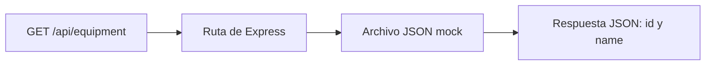

# Plan 002 — API Core mínimo con equipos simulados

- **Spec:** [002](spec.md)
- **Estado:** Aprobado
- **Fecha de aprobación:** 2026-10-02

## Enfoque

Crear un servicio local pequeño con el stack definido: Node.js, Express 4.21.x,
TypeScript 5.x y ES Modules. Exponer únicamente la comprobación del servicio y el
listado de equipos, sin SQL Server ni capas adicionales de aplicación.

Las decisiones de este plan están aprobadas; las instalaciones requieren validación de paquetes y autorización explícita.

## Diseño

### Archivos y responsabilidades

| Archivo en `api-core/` | Responsabilidad |
|-----------------------|-----------------|
| `package.json` | Dependencias y comandos dev/build/start. |
| `tsconfig.json` | Comprobación de tipos y generación de JavaScript en dist/. |
| `src/server.ts` | Leer configuración, validarla y arrancar la escucha. |
| `src/app.ts` | Crear Express, registrar rutas y respuestas 404/500. |
| `src/routes/equipment.ts` | Atender el listado y leer el JSON mock. |
| `src/data/equipment.json` | Equipos ficticios con identificador y nombre. |
| `.env` (ignorado) | Configuración local de escucha, sin versionar. |

Actualizar el `.env.example` existente en la raíz para documentar las variables del servicio.
No añadir controllers, services ni una abstracción genérica de repositorios para una sola
fuente mock. La integración de datos futura se diseña cuando se incorpore SQL Server,
conforme al [ADR 0002](../../docs/adr/0002-sql-server-y-repositorios-mock.md).

### Solicitudes y respuestas

- `GET /health`: HTTP 200 con un objeto JSON de estado, con `status: ok`.
  Confirma que el servicio responde; no comprueba datos ni base de datos.
- `GET /api/equipment`: HTTP 200 con un arreglo JSON de equipos. Se usan los nombres
  de campo `id` y `name`, ambos de texto; usar identificadores distintos y nombres ficticios.
- Ruta inexistente: HTTP 404 con un mensaje JSON sencillo.
- Fallo al leer o interpretar el mock: HTTP 500 con un mensaje JSON genérico, sin rutas
  internas, contenido del archivo ni detalles sensibles.

Leer el archivo desde una ruta relativa al módulo, independiente del directorio desde el
que se inicia Node.js. La lectura se realiza al atender la consulta; un fallo se entrega
al manejador de errores. En Express 4, capturar explícitamente los errores asíncronos y
pasarlos al manejador; no asumir que una promesa rechazada se procesa automáticamente.

### Configuración y ejecución

Usar `API_CORE_HOST` y `API_CORE_PORT` como variables de escucha; en local sus valores
son `127.0.0.1` y `3002`. Validar que la configuración esté presente y que el puerto sea un
entero válido antes de abrir la escucha. Si es inválida o el puerto está ocupado, informar
el fallo de arranque y terminar; no cambiar silenciosamente a otro puerto.

Flujo aceptado para los comandos, sin herramientas adicionales de ejecución TypeScript:

- `build`: comprobar tipos y compilar; copiar el JSON mock a `dist/data/`. Si hay errores
  de tipos, la compilación debe fallar y no arrancar el servicio con una salida anterior.
- `start`: ejecutar `dist/server.js` con Node.js y la configuración local de entorno.
- `dev`: ejecutar build y, solo si termina correctamente, start. Tras un cambio, detener
  el proceso y ejecutar dev otra vez. La recarga automática queda fuera del alcance inicial.

**TypeScript → comprobación y compilación → JavaScript en dist/ → Node.js ejecuta.**

El mecanismo de copia del JSON y los comandos exactos se concretan al implementar con
herramientas de Node.js ya disponibles; no incorporar un paquete solo para copiar un archivo.
La carga local de `.env` puede usar la capacidad nativa de Node.js 24; no requiere dotenv.

## Decisiones

- **Aceptada — Express directo:** comenzar con el framework del stack. Se descarta el paso
  previo con HTTP nativo porque añade una implementación temporal que no necesita el entregable.
- **Aceptada — desarrollo compilado:** dev compila y arranca el JavaScript. Comparte el
  recorrido de producción y comprueba tipos. Node.js 24 también puede ejecutar TypeScript
  con sintaxis compatible, pero no comprueba tipos por sí solo. tsx/ts-node añadirían una
  dependencia que este flujo mínimo no necesita. Tras un cambio, detener y ejecutar dev de nuevo.
- **Aceptada — contrato mínimo:** arreglo JSON con id y name, sin estado ni envoltorios
  adicionales. Implementación explícita de rutas, configuración y errores.
- **Dependencias:** todavía no hay package.json ni lockfile de aplicación. Evaluar versiones
  exactas de Express 4.21.x, TypeScript 5.x y tipos necesarios antes de proponer su instalación,
  indicando paquete, finalidad, producción/desarrollo y comando. No cambiar el stack.

## Respuesta a preguntas abiertas

- **P1:** aceptados identificador y nombre. Se usan id y name como nombres técnicos de campos.
- **P2:** aceptado Express directo; sin implementación previa con HTTP nativo.
- **P3:** aceptado dev compilando antes de arrancar; sin recarga automática ni ejecutor TypeScript adicional.

## Trazabilidad

| Requisito | Cómo se cumple |
|-----------|----------------|
| R1 | Ruta /health independiente de datos; petición HTTP verifica 200 y estado JSON (CA1). |
| R2 | Ruta /api/equipment devuelve el arreglo id/name del archivo mock (CA2). |
| R3 | Archivo ficticio local, sin driver ni conexión SQL Server (CA3). |
| R4 | Variables de escucha documentadas y validadas; probar cambio de puerto y loopback (CA4). |
| R5 | Respuestas JSON 404/500; probar ruta desconocida y fallo controlado de lectura del mock, restaurándolo después (CA5). |
| R6 | dev compila/arranca; build genera dist/ con el JSON y start lo ejecuta; probar ambas rutas en desarrollo y compilación (CA6). |

## Riesgos

- **Mock ausente en dist/:** incluirlo en build y comprobar el endpoint después de compilar.
- **JavaScript desactualizado:** dev recompila antes de arrancar; no ejecutar start si build falla.
- **Errores asíncronos sin respuesta:** capturarlos y entregarlos al manejador 500 de Express 4.
- **Sobreingeniería:** mantener una ruta y un archivo mock; diseñar el acceso SQL cuando exista
  ese requisito, sin añadir capas o librerías por anticipado.
